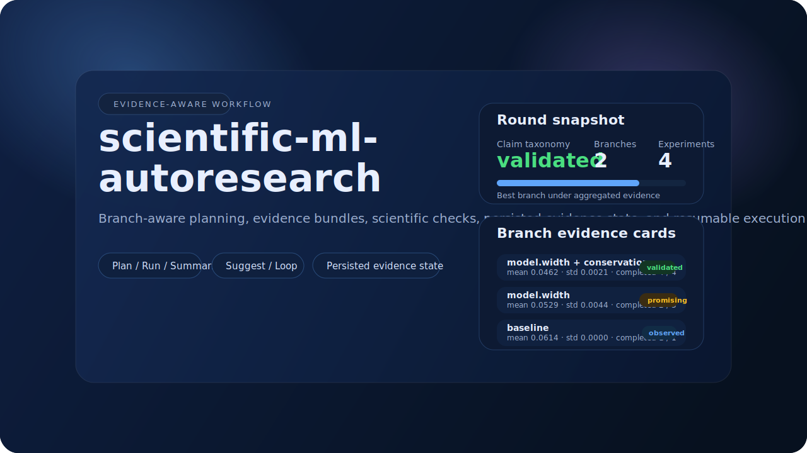

# scientific-ml-autoresearch

[English](./README.md) | 简体中文

一个完整、轻量、证据感知型的 scientific machine learning 自动研究工作流。

[](./docs/workflow-ui/index.html)

## 快速入口

- **静态界面**: `docs/workflow-ui/index.html`
- **GitHub Pages**: 从 `docs/` 目录部署的仓库页面
- **任务格式**: `docs/task-format.md`
- **扩展说明**: `docs/extending.md`
- **示例**: `examples/advection/`, `examples/burgers/`
- **CLI**: `autoresearch init / plan / run / summarize / suggest / loop / status`

## 仓库概览

| 区域 | 作用 |
|---|---|
| `src/autoresearch/` | planner、runner、evidence、summary、suggestion、storage、loop |
| `examples/` | 最小可运行的 scientific ML 示例 |
| `docs/` | 任务格式、扩展说明、架构说明、静态工作流界面 |
| `tests/` | 覆盖 workflow、evidence、recovery 与 planner 的测试 |

## 核心特性一览

- 面向 branch 的计划机制，支持两层预算分配
- constraints 与 robustness checks 的结构化处理
- branch evidence card、claim taxonomy 与 evidence gap 检测
- 持久化 evidence state 与可恢复执行
- provenance 与 artifact validity 跟踪

## 项目定位

**scientific-ml-autoresearch** 把 scientific ML 研究中的一条典型循环组织成一个完整工作流：

- 规划实验分支
- 执行训练与评估
- 记录 scientific checks
- 汇总证据状态
- 生成下一轮建议

这个仓库不是完整的 MLOps 平台，也不是“全自动科学家”。
它是一个可运行、结构清晰、证据感知型的研究工作流，强调 branch 结构、evidence 跟踪与恢复能力。

## 工作流循环

主循环由以下步骤组成：

1. `plan`：根据 task spec、history 与 evidence state 生成 round plan
2. `run`：执行 train / eval，并写入 metrics、checks 与 provenance
3. `summarize`：生成 round summary，重点展示 branch evidence 与 scientific checks
4. `suggest`：根据 claim taxonomy 与 evidence gaps 生成下一轮建议
5. `loop`：把整个 round-based workflow 串联成持续运行的研究循环

## 核心设计

### 1. 分支优先的计划方式
系统把一个 round 看成若干 **canonical branches** 的预算分配问题，而不是单纯的配置枚举。

每个 branch 可以扩展成多个 evidence members，例如：

- 不同 seed
- 不同 evaluation regime

这使 workflow 可以同时表达：

- 探索的广度
- 验证的深度

### 2. 证据感知的研究判断
系统不会只记录“谁最好”，还会维护：

- branch evidence cards
- claim taxonomy
- evidence gaps
- partial bundle completion

它能够区分：

- observed
- promising
- validated
- unsupported

这些状态会反馈到 planner 与 suggester 中。

### 3. scientific checks 是一等 workflow 对象
`constraints` 与 `robustness_checks` 不是备注，它们会进入：

- runner
- evidence state 生成
- summary
- suggestion
- planning decisions

这让 scientific ML 中常见的验证逻辑，例如：

- conservation
- stability
- shifted-grid robustness
- noisy-observation robustness

成为真正可追踪的 workflow 对象。

### 4. 可靠性层
仓库当前包含完整的 workflow reliability 基础：

- `provenance.json`
- artifact validity flags
- `round_XX_evidence_state.json`
- resume / rerun policy
- invalid artifact recovery

这意味着 workflow 不只是“会建议”，也能够在中断后继续运行，并对结果有效性给出明确判断。

## 主要文件与输出

典型运行目录会包含：

- `task.yaml`
- `round_XX_plan.yaml`
- `round_XX_evidence_state.json`
- `round_XX_summary.md`
- `round_XX_suggestions.md`
- `history.json`

每个 experiment 目录中通常包含：

- `config.yaml`
- `train.log`
- `eval.log`
- `metrics.json`
- `provenance.json`
- robustness artifacts

## CLI 入口

```bash
autoresearch init --example advection --output runs/advection_demo
autoresearch plan --task runs/advection_demo/task.yaml
autoresearch run --task runs/advection_demo/task.yaml
autoresearch summarize --run runs/advection_demo
autoresearch suggest --run runs/advection_demo
autoresearch loop --task runs/advection_demo/task.yaml --rounds 3
autoresearch status --run runs/advection_demo
```

## 文档与界面

- 任务格式：`docs/task-format.md`
- 扩展说明：`docs/extending.md`
- 静态工作流界面：`docs/workflow-ui/index.html`

静态界面使用纯 HTML / CSS / JS 编写，可以直接在浏览器中打开。

## 许可证

MIT
